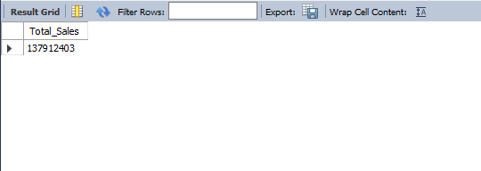
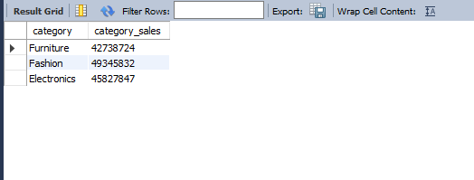
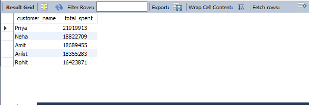

# 📊 Sales Data Analysis Project using Excel & MySQL

## 🚀 Project Overview

This project demonstrates a complete **end-to-end Sales Data Analysis workflow** using Excel and MySQL.

The objective was to:

- Import raw Excel data into MySQL  
- Design a normalized relational database  
- Perform DDL, DML, and DQL operations  
- Apply Joins, Aggregations, Subqueries, Views, Indexing  
- Generate real-world business insights  

The dataset contains **1000+ sales records** including customer details, product information, order data, and payment modes.

---

## 🗂️ Dataset Details

**Excel Sheet Name:** `SalesData`

### Columns Included:

- OrderID  
- OrderDate  
- CustomerID  
- CustomerName  
- Product  
- Category  
- Quantity  
- UnitPrice  
- City  
- PaymentMode  

---

## 🏗️ Database Design (Normalization)

The raw Excel data was normalized into 3 logical tables:

### 1️⃣ Customers Table
- `customer_id` (Primary Key)  
- `customer_name`  
- `city`  

### 2️⃣ Products Table
- `product_id` (Primary Key, Auto Increment)  
- `product_name`  
- `category`  
- `unit_price`  

### 3️⃣ Orders Table
- `order_id` (Primary Key)  
- `order_date`  
- `customer_id` (Foreign Key)  
- `product_id` (Foreign Key)  
- `quantity`  
- `payment_mode`  

This structure eliminates redundancy and improves data integrity.

---

## ⚙️ Project Implementation Steps

### ✅ Step 1: Create Database (DDL)
```sql
CREATE DATABASE sales_project;
USE sales_project;
```

---

## ✅ Step 2: Create Tables (DDL)

Created normalized tables using:

- Primary Keys  
- Foreign Keys  
- Constraints  

---

## ✅ Step 3: Import Excel Data into MySQL

Used **MySQL Workbench → Table Data Import Wizard**

- Imported `sales_data_1000_rows.xlsx`
- Loaded data into a staging table (`sales_raw`)

---

## ✅ Step 4: Insert Cleaned Data (DML)

Inserted data into structured tables using:

- `SELECT DISTINCT`
- `JOIN`
- Insert-select queries

---

## ✅ Step 5: Business Analysis Queries (DQL)

Performed real-world business queries including:

- Total Sales Revenue  
- Sales by Category  
- Top 5 Customers by Revenue  
- Customers with Above-Average Purchase  
- Sales by City (Stored Procedure)  

---

# 📈 Key Business Insights

## 💰 1️⃣ Total Sales Revenue
```sql
SELECT SUM(o.quantity * p.unit_price) AS total_sales
FROM orders o
JOIN products p ON o.product_id = p.product_id;
```
<p align="center">
  
</p>

## 🛍️ 2️⃣ Sales by Category

```sql
SELECT 
    p.category,
    SUM(o.quantity * p.unit_price) AS category_sales
FROM orders o
JOIN products p ON o.product_id = p.product_id
GROUP BY p.category;
```
<p align="center">
  
</p>

## 👑 3️⃣ Top 5 Customers by Sales

```sql
SELECT 
    c.customer_name,
    SUM(o.quantity * p.unit_price) AS total_spent
FROM orders o
JOIN customers c ON o.customer_id = c.customer_id
JOIN products p ON o.product_id = p.product_id
GROUP BY c.customer_name
ORDER BY total_spent DESC
LIMIT 5;
```
<p align="center">
  
</p>

---

## 🧠 Advanced SQL Concepts Used

- ✔️ DDL (`CREATE DATABASE`, `CREATE TABLE`)
- ✔️ DML (`INSERT`, `SELECT DISTINCT`)
- ✔️ DQL (`SELECT`, `GROUP BY`, `ORDER BY`, `LIMIT`)
- ✔️ JOINS (INNER JOIN)
- ✔️ Subqueries
- ✔️ Views
- ✔️ Indexing
- ✔️ Stored Procedures
- ✔️ Aggregation Functions (`SUM`, `COUNT`, `AVG`)


